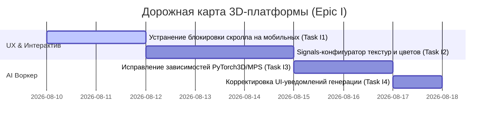

# Техническая презентация и дорожная карта 3D-платформы
## Angular 3D E-commerce Storefront

Этот документ представляет собой обзор технических преимуществ 3D-интеграции в проекте «Angular E-commerce 3D», архитектурных решений, обеспечивающих высокую производительность, и список предстоящих задач для доработки продукта до уровня коммерческого бестселлера на маркетплейсах (ThemeForest, Gumroad и др.).

---

## 💎 Уникальное торговое предложение (USP) шаблона

Интеграция интерактивного 3D в интернет-магазины — мощный коммерческий тренд. Большинство шаблонов на рынке ограничены стандартной плоской галереей изображений. 

Этот шаблон предлагает **3D-First подход** для товаров с высоким средним чеком (мебель, обувь, аксессуары, кастомные продукты), преодолевая технические сложности интеграции WebGL в Angular:
1. **Высокая стоимость копии**: Обычные e-commerce шаблоны продаются за $30–$50. Шаблоны с 3D-конфигуратором легко оцениваются в **$80–$150+**.
2. **Преодоление барьера производительности**: WebGL и библиотеки 3D-рендеринга часто перегружают клиентские устройства. В данном шаблоне решены проблемы долгой загрузки и низкой частоты кадров (FPS).
3. **Интегрированная генерация 3D через AI**: Встроенный Python-сервис для автоматического создания 3D-моделей по картинке является киллер-фичей для владельцев магазинов.

---

## 🛠️ Архитектурные особенности и оптимизация (Как это работает)

Кодовая база уже реализует передовые практики оптимизации 3D в вебе:

### 1. Отложенная загрузка и динамическое разделение кода (Lazy Loading & Code Splitting)
*   **Viewport Lazy Loading**: Компонент [`ThreeDViewerComponent`](file:///Users/andrii/Documents/myProjects/angular-ecommerce-3d/src/app/components/three-d-viewer/three-d-viewer.component.ts) не инициализирует холст WebGL и не скачивает ресурсы, пока товар находится вне зоны видимости. Используется `IntersectionObserver` с опережающим порогом в 100px.
*   **Dynamic Bundle Splitting**: Библиотеки `three.js`, `GLTFLoader`, `DRACOLoader` и `MeshoptDecoder` не входят в основной JS-бандл приложения. Они загружаются динамически (`Promise.all([import('three'), ...])`) только при активации 3D-режима, что сохраняет Google PageSpeed показатели.

### 2. Экстремальное сжатие моделей (Draco & Meshopt)
*   Сервис [`ThreeDModelService`](file:///Users/andrii/Documents/myProjects/angular-ecommerce-3d/src/app/core/services/three-d-model.service.ts) из коробки поддерживает декодирование сжатых мешей через **Draco Compression** (использует Google WebAssembly декодеры) и **Meshopt Decoder**. Это позволяет сократить вес `.glb` файлов на 70-80% без потери качества геометрии.

### 3. Изоляция зоны Angular (NgZone)
*   Прямые манипуляции с DOM и рендеринг через `requestAnimationFrame` вынесены за пределы цикла обнаружения изменений Angular с помощью `NgZone.runOutsideAngular()`. 
*   Приложение сохраняет **стабильные 60 FPS**, так как циклы анимации Three.js не вызывают постоянный пересчет компонентов страницы. В зону Angular приложение возвращается только для обновления критического UI-статуса (завершение загрузки, индикатор прогресса, ошибки).

### 4. Полноценная поддержка SEO (SSR & Hydration)
*   Используется серверный рендеринг Angular 17 (`@angular/ssr`). Текстовое описание товара, характеристики и структура страницы генерируются на сервере для идеального сканирования поисковыми роботами.
*   3D-компонент защищен проверкой `isPlatformBrowser`. Холст WebGL «оживает» и гидрируется только на стороне клиента.

### 5. Продвинутое кэширование и управление памятью
*   `ThreeDModelService` кэширует оригинальные сцены моделей и при повторном открытии клонирует их через `SkeletonUtils.clone` (для сохранения скелетной анимации).
*   При переключении товаров или уничтожении компонента срабатывает глубокая очистка геометрии и материалов (`disposeModel`), освобождая видеопамять (GPU VRAM) и исключая падение контекста WebGL.

---

## 🚀 Дорожная карта задач (Предстоящие доработки)

Для превращения шаблона в полноценный коммерческий хит необходимо реализовать следующие задачи:

### 📋 Эпик I — Оптимизация UX и интерактивный конфигуратор



---

### [Task I1] Устранение блокировки скролла на мобильных (Mobile Responsive Scroll Trap)
*   **Проблема**: В текущей реализации холст WebGL использует `touch-action: none` и перехватывает все жесты перемещения пальца (`event.stopPropagation()`). На смартфонах, если холст занимает >50% экрана, пользователь застревает на 3D-модели и не может пролистать страницу вниз.
*   **Решение**:
    - Добавить оверлей "Tap to Orbit" (Нажмите для управления 3D) на мобильных экранах. До активации кликом холст игнорирует события тача (`pointer-events: none`), позволяя прокручивать страницу.
    - В качестве альтернативы настроить `OrbitControls` на распознавание жестов: поворот модели только одним пальцем, но без блокировки дефолтного скролла страницы при вертикальном движении, либо скролл страницы двумя пальцами.
*   **Срок**: 2 дня.
*   **Файлы**: [`three-d-viewer.component.ts`](file:///Users/andrii/Documents/myProjects/angular-ecommerce-3d/src/app/components/three-d-viewer/three-d-viewer.component.ts), [`three-d-viewer.component.scss`](file:///Users/andrii/Documents/myProjects/angular-ecommerce-3d/src/app/components/three-d-viewer/three-d-viewer.component.scss)

---

### [Task I2] Интерактивный конфигуратор на базе Angular Signals
*   **Задача**: Реализовать моментальное изменение цвета или текстуры отдельных частей 3D-модели (например, подошвы обуви или ткани мебели) при клике на цветовую палитру на PDP.
*   **Детали реализации**:
    - Описать входной Signal или RxJS-поток в `ThreeDViewerComponent`, принимающий массив настроек материалов: `[{ meshName: 'Sole', color: '#ff0000' }]`.
    - Написать обход графа сцены (`traverse`) при изменении конфигурации для поиска нужного `Mesh` и смены его материала:
      ```typescript
      updateMaterials(config: { meshName: string, color: string }[]) {
        if (!this.model) return;
        this.model.traverse((child: any) => {
          if (child.isMesh) {
            const match = config.find(c => child.name.includes(c.meshName));
            if (match) {
              child.material.color.setHex(parseInt(match.color.replace('#', '0x')));
            }
          }
        });
      }
      ```
    - Добавить на PDP панель выбора опций товара и связать её с компонентом просмотра.
*   **Срок**: 3 дня.
*   **Файлы**: [`three-d-viewer.component.ts`](file:///Users/andrii/Documents/myProjects/angular-ecommerce-3d/src/app/components/three-d-viewer/three-d-viewer.component.ts), [`product-detail.component.html`](file:///Users/andrii/Documents/myProjects/angular-ecommerce-3d/src/app/components/product-detail/product-detail.component.html), новые конфигурационные компоненты.

---

### [Task I3] Настройка окружения AI-воркера и PyTorch3D на Mac (MPS)
*   **Проблема**: Воркфлоу генерации 3D приостановлен. Установка `pytorch3d` на macOS (Apple Silicon M-серии) дает сбой из-за отсутствия готовых pre-built колес (wheels). Библиотека `transformers` в InstantMesh вызывает ошибку импорта `find_pruneable_heads_and_indices`.
*   **Решение**:
    - Собрать `pytorch3d` из исходников под macOS c поддержкой MPS (Metal Performance Shaders) или заменить Unique3D на Hunyuan3D-V2 в качестве основной модели генерации, которая не требует специфичных бинарных сборников.
    - Разрешить конфликты версий библиотек в `requirements.txt` воркера, зафиксировав версии `transformers` и `torch` под macOS MPS.
*   **Срок**: 2 дня.
*   **Файлы**: [`requirements.txt`](file:///Users/andrii/Documents/myProjects/angular-ecommerce-3d/local-ai-worker/requirements.txt), [`setup_mac.sh`](file:///Users/andrii/Documents/myProjects/angular-ecommerce-3d/local-ai-worker/setup_mac.sh), [`3D_GENERATION_STATUS.md`](file:///Users/andrii/Documents/myProjects/angular-ecommerce-3d/3D_GENERATION_STATUS.md)

---

### [Task I4] Исправление UI-уведомлений статуса AI-генерации (Toast Bug)
*   **Проблема**: При сбое генерации на стороне воркера бэкенд возвращает статус `failed`, но на фронтенде отображается всплывающее окно "AI Generation failed: success". Ошибка вызвана некорректным маппингом полей ответа бэкенда (вытягивается текст HTTP-статуса `'success'` вместо тела ошибки задачи).
*   **Решение**:
    - Проверить модель ответа polling-интерфейса в Angular.
    - Переписать вывод сообщения об ошибке, чтобы он брал значение `task.error` или `task.message`, возвращаемое сервером.
*   **Срок**: 1 день.
*   **Файлы**: Компоненты админки управления задачами генерации 3D.
