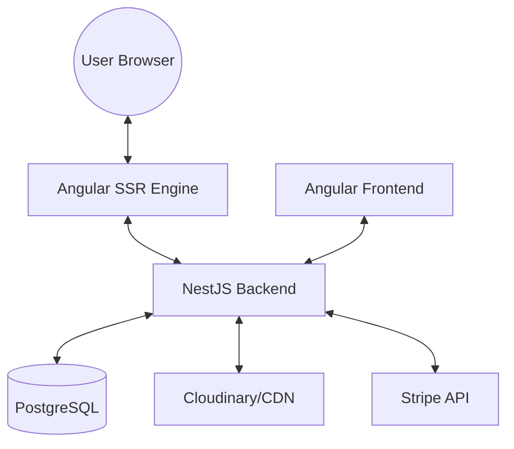

# Project Architecture

The **Angular 3D E-commerce Platform** is a full-stack application designed for high performance, SEO friendliness, and visual impact.

## 🏗 High-Level Architecture

## 💻 Frontend (Angular 17+)

### Key Technologies
- **Angular SSR (Universal)**: Pre-renders pages on the server for instant loading and SEO.
- **Three.js**: Handles the rendering of 3D models in the browser.
- **Hydration**: Uses Angular's modern hydration for a flicker-free transition from server to client.
- **Standalone Components**: Modular architecture for better maintenance.

### Core Modules
- `AppModule`: The main entry point.
- `CoreModule`: Services, guards, and interceptors (Singleton).
- `SharedModule`: Reusable UI components, modals, and directives.

## ⚙️ Backend (NestJS 10+)

### Key Technologies
- **TypeORM**: Database abstraction layer supporting PostgreSQL.
- **Passport/JWT**: Secure authentication system.
- **Swagger**: Automated API documentation (available at `/api/docs`).

### Module Structure
Each feature (Products, Orders, Auth) is encapsulated in its own module following NestJS best practices.

## 🚀 Performance Optimizations
1. **Lazy Loading**: Only loads code for the current route.
2. **Dynamic API Fallback**: Smart detection of backend availability.
3. **Image Transformation**: Auto-WebP conversion for faster image delivery.
