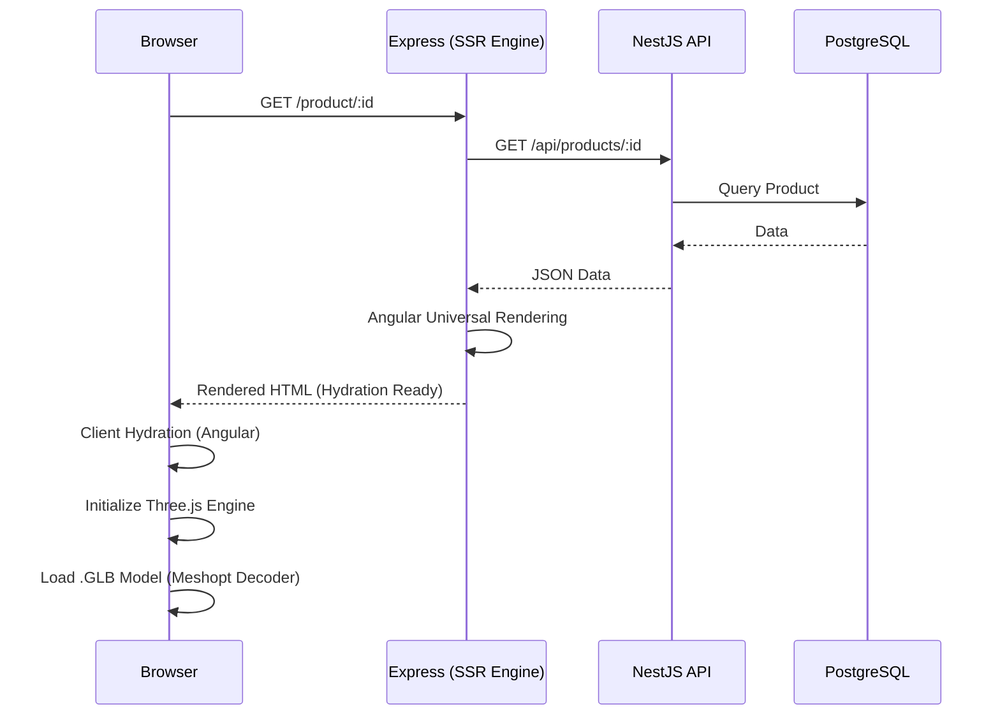

# Technical Architecture

A technical overview of the platform's architecture, including rendering lifecycles and service layer patterns.

## System Interaction Flow

The platform utilizes a hybrid rendering approach, leveraging Angular SSR for initial document delivery and client-side Three.js for interactive 3D rendering.

## Frontend Internals (Angular 17)

### Rendering & Hydration
- **CommonEngine**: Utilized within `server.ts` to execute the application bundle on the server.
- **Client Hydration**: Implemented via `provideClientHydration()` in `AppModule`. This prevents "flicker" by reusing the server-rendered DOM.
- **Platform-Specific Logic**: Critical browser-only features (Three.js, window events) are guarded using `isPlatformBrowser(platformId)`.

### 3D Execution Environment
- **Engine**: Three.js r158.
- **Decoder**: `meshopt_decoder` is utilized for efficient geometry decompression of GLB models.
- **Lighting Model**: A combination of `AmbientLight` and `DirectionalLight` (with `PCFSoftShadowMap` support on desktop) ensures high-fidelity product presentation.

## Backend Service Layer (NestJS 10)

### Reactive Pattern
The backend utilizes RxJS `Observable` streams within services (e.g., `AuthService`) to handle complex asynchronous operations like password hashing (`bcrypt`), database persistence (`TypeORM`), and event notifications.

### Authentication Strategy
- **JWT**: Stateless authentication using signed tokens.
- **Passpost**: Implements specific strategies for secure route protection.
- **DTOs**: Strict input validation using `class-validator` and `ValidationPipe`.

## Data Architecture
- **TypeORM Registry**: Centralized entity management for consistent schema synchronization.
- **Storage**: Integrated support for local file storage (uploads/) and Cloudinary CDN failover.
