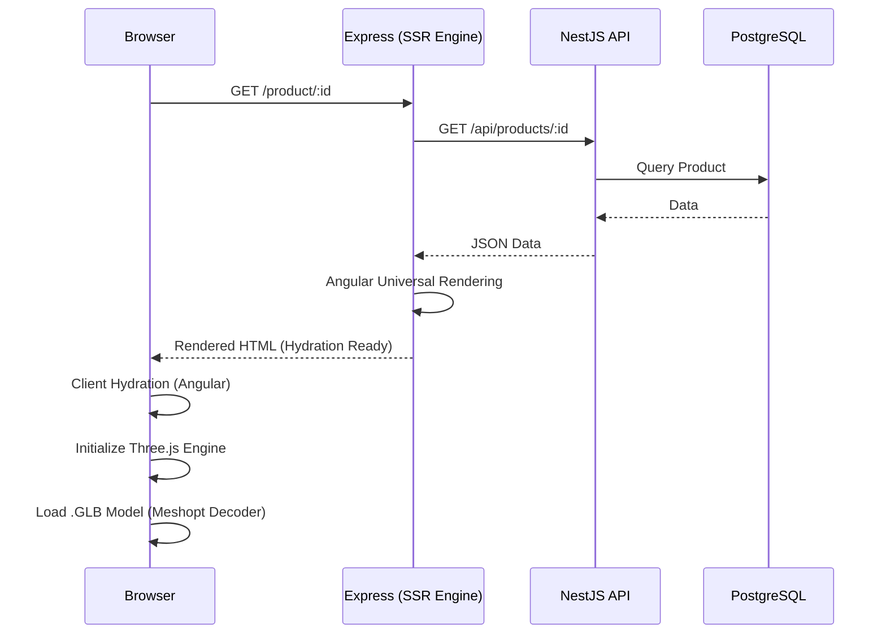
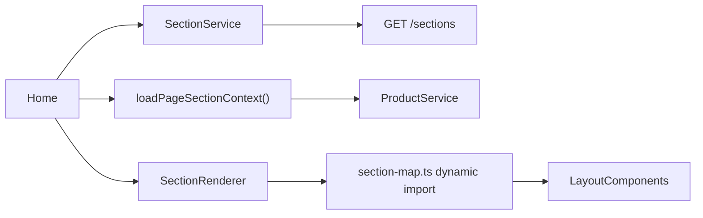

# Technical Architecture

A technical overview of the platform's architecture, including rendering lifecycles, layer boundaries, and build/dev performance.

> **Build & DX audit**: [BUILD_AND_DEV_PERFORMANCE.md](BUILD_AND_DEV_PERFORMANCE.md)  
> **Refactoring tasks**: [REFACTORING_BOARD.md](REFACTORING_BOARD.md) § Epic J  
> **Backend detail**: [BACKEND_ARCHITECTURE.md](BACKEND_ARCHITECTURE.md)

**Last updated**: 2026-08-26

---

## System Interaction Flow

The platform utilizes a hybrid rendering approach, leveraging Angular SSR for initial document delivery and client-side Three.js for interactive 3D rendering.



---

## Repository layout

```
angular-ecommerce-3d/
├── src/
│   ├── app/              # Storefront (Angular)
│   ├── admin/            # Admin panel (lazy route /admin)
│   ├── shared/           # Models, utils — safe for app + admin
│   └── environments/
├── backend/              # NestJS API (separate package.json)
├── docs/                 # Developer + marketplace documentation
└── angular.json          # Single Angular app (storefront + admin)
```

### Intended layer boundaries

| Layer | Path | May import from |
|-------|------|-----------------|
| Storefront | `src/app/` | `shared/`, `environments/`, `app/core/` |
| Admin | `src/admin/` | `shared/`, `environments/`, `app/` (shared UI only, e.g. `ThreeDViewerComponent`) |
| Shared | `src/shared/` | `shared/` only |
| Backend | `backend/src/` | Nest modules only |

**Current violation (Epic J3)**: storefront pages import `SectionService` from `src/admin/services/`. Target: public services in `src/app/core/services/`.

---

## Frontend Internals (Angular 17)

### Module strategy

| Area | Pattern | Notes |
|------|---------|-------|
| Root | `AppModule` (NgModule) | Bootstraps app, global providers, PWA, i18n |
| Storefront pages | Lazy `loadChildren` | `home`, `shop`, `product-detail` |
| Admin | Lazy `/admin` → `AdminModule` | **Monolithic** — most pages eager inside module (~1.6 MB chunk) |
| Page sections | `SectionRendererComponent` + `section-map.ts` | Dynamic `import()` per section type ✅ |
| Layout components | Standalone + section-map | **Also** eagerly imported in `AppModule` ⚠️ duplicate |

### Rendering & Hydration

- **CommonEngine**: Utilized within SSR bundle to execute the application on the server.
- **Client Hydration**: `provideClientHydration()` in `AppModule`.
- **Platform-Specific Logic**: Three.js and browser APIs guarded with `isPlatformBrowser(platformId)`.

### Section-driven pages

Home, shop, and custom pages load **active sections** from the API and render them via `app-section-renderer`:



### 3D Execution Environment

- **Engine**: Three.js r158.
- **Decoder**: `meshopt_decoder` for GLB geometry.
- **Lighting**: `AmbientLight` + `DirectionalLight` (PCFSoftShadowMap on desktop).

### Build pipeline (summary)

| Setting | Current | Target (Epic J) |
|---------|---------|-----------------|
| Builder | `browser` (webpack) | `application` (esbuild) |
| TS scope | All `src/**/*.ts` | Optional split projects |
| Dev command | `npm start` / `ng serve` | Same; faster after J2 |

See [BUILD_AND_DEV_PERFORMANCE.md](BUILD_AND_DEV_PERFORMANCE.md) for measured times and task list.

---

## Backend Service Layer (NestJS 10)

### Module map

Monolithic NestJS app with domain modules: `Products`, `Categories`, `Orders`, `Auth`, `Sections`, `Settings`, `Payments`, `Uploads`, `Seo`, `Recommendations`, `AiGeneration`, `Pages`, `Newsletter`.

### Reactive pattern

RxJS `Observable` streams in services for async work (bcrypt, TypeORM, external HTTP).

### Authentication

- **JWT** stateless tokens
- **Passport** strategies (local, JWT)
- **DTOs** validated with `class-validator`

### Development commands

```bash
cd backend
npm run start:dev   # ✅ daily development (watch)
npm run start:prod  # production
npm start           # ⚠️ full rebuild — avoid for dev
```

---

## Data Architecture

- **TypeORM** with PostgreSQL; `synchronize: true` in non-production environments.
- **Storage**: Local `uploads/` + Cloudinary CDN.
- **Settings**: Key-value `Settings` entity for shop catalog, best sellers, payment config.

---

## Duplicate services (technical debt)

The following classes exist **twice** (admin vs storefront) with the same name:

- `ProductService`, `AuthService`, `CategoryService`, `PaymentService`, `MessageService`, `NotificationService`

Consolidation tracked in [task_009](tasks/task_009_consolidate_shared_services_models.md).

---

## Marketplace maintainability checklist

For agents and buyers forking the template:

1. Use **`npm run start:dev`** for backend, not `npm start`.
2. Do not import `src/admin/` from `src/app/` (except lazy admin route).
3. Add new section types via `section-map.ts` + admin form + backend if needed.
4. Follow [AI_CONSTITUTION.md](AI_CONSTITUTION.md) — no `!important`, use design tokens.
5. Track build/DX work on [REFACTORING_BOARD.md](REFACTORING_BOARD.md) Epic J.

---

## Related documentation

| Document | Purpose |
|----------|---------|
| [BUILD_AND_DEV_PERFORMANCE.md](BUILD_AND_DEV_PERFORMANCE.md) | Build audit, Epic J tasks |
| [BACKEND_ARCHITECTURE.md](BACKEND_ARCHITECTURE.md) | Full API/module reference |
| [STYLE_ARCHITECTURE.md](STYLE_ARCHITECTURE.md) | Tokens, themes, SCSS |
| [MARKETPLACE_LAUNCH_ROADMAP.md](MARKETPLACE_LAUNCH_ROADMAP.md) | Launch checklist |
