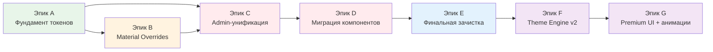

# Refactoring Board — единый трекер рефакторинга

> **Это единственный источник истины по прогрессу рефакторинга.**
> Статусы задач обновляются ТОЛЬКО здесь. Остальные документы (`PROJECT_STATUS.md`, `UI_AUDIT.md`, `REDESIGN_PLAN.md`) ссылаются сюда.
>
> **Baseline аудита**: 2026-07-28 (полный скан кодовой базы)
> **Последнее обновление**: 2026-07-28
> **Владелец**: Principal UI Architect

---

## 1. Дашборд метрик

Метрики измерены сканом кода 2026-07-28. Это объективные показатели завершённости рефакторинга — обновляй их после каждого эпика.

| # | Метрика | Baseline (2026-07-28) | Сейчас | Цель | Прогресс |
|---|---------|----------------------|--------|------|----------|
| M1 | Hardcoded hex в SCSS (вне tokens/themes) | 1 336 в 68 файлах | 1 336 | 0 | ░░░░░░░░░░ 0% |
| M2 | Использований `--admin-*` | 2 335 в 43 файлах | **2 017** (B3: removed component Material dumps that referenced `--admin-*`) | 0 (кроме layout-токенов) | ▓░░░░░░░░░ 14% |
| M3 | `!important` | 91 в 12 файлах | **76** (A5: −15 из orphan) | 0 | ▓░░░░░░░░░ 16% |
| M4 | `::ng-deep` | 40 в 12 файлах | **25** (B3: removed component Material `::ng-deep` dumps) | 0 | ▓▓▓▓░░░░░░ 38% |
| M5 | Компоненты полностью на semantic-токенах (без hex) | 3 / 86 | 3 / 86 | 86 / 86 | ▓░░░░░░░░░ 3% |
| M6 | Legacy `_theme-variables.scss` | 722 строки, подключён | **удалён** | удалён | ██████████ 100% |
| M7 | Orphaned `src/styles.scss` | 499 строк логики | **удалён** | удалён | ██████████ 100% |
| M8 | Централизованный `_material-overrides.scss` | нет; overrides в 24 файлах | **Epic B 4/4** (B4: palette↔tokens); residual: admin-global + themes → C5 | 1 файл с правилами | ▓▓▓▓▓▓▓▓▓░ 90% |

**Команды для перепроверки метрик:**

```bash
# M1: hex вне токенов/тем
rg -c '#[0-9a-fA-F]{3,8}\b' src --glob '*.scss' --glob '!src/styles/tokens/**' --glob '!src/styles/themes/**' --glob '!src/admin/styles/_admin-{light,dark,glass,dark-glass}.scss' --glob '!src/admin/styles/admin-variables.scss'
# M2: параллельная admin-система
rg -c '\-\-admin-' src --glob '*.scss'
# M3 / M4
rg -c '!important' src --glob '*.scss'
rg -c '::ng-deep' src --glob '*.scss'
```

---

## 2. Карта состояния: что реально есть в коде

Результат аудита 2026-07-28. Важно: **предыдущие записи в документации завышали прогресс** — например, «Phase 3 Complete», хотя легаси-монолит всё ещё подключён.

### ✅ Реально работает

| Что | Где | Подтверждение |
|-----|-----|---------------|
| Каркас токенов (primitive + semantic) | `src/styles/tokens/` | `_primitive-tokens.scss` (105 стр.), `_semantic-tokens.scss` (47 стр.) |
| Темы переписаны на semantic-токены | `src/styles/themes/` | `_default.scss`, `_dark.scss`, `_glass.scss` |
| Entry point imports-only | `src/styles/main.scss` | 19→22 строк, только импорты; подключён в `angular.json` |
| Material overrides (central) | `src/styles/overrides/` | B1–B4 done: component `.mat-` = 0; host-scoped B3; palette↔tokens (B4). Residual: `admin-global` / theme-file `.mat-` → C5 |
| ThemeService: переключение, персистентность, admin/front зоны | `src/app/core/themes/` | 4 темы; `data-theme` на `<html>` и `<body>` |
| 3 компонента полностью мигрированы | `favorites`, `base-modal`, `cart-modal` | Semantic-токены, 0 hex |
| ~29 компонентов частично мигрированы | storefront | Semantic-токены + остаточные hex |
| Регрессии Glass/Admin-тем починены | Task-008, 015–017, 021, 022 | См. changelog в `PROJECT_STATUS.md` |

### ❌ Главные проблемы (по убыванию веса)

| # | Проблема | Масштаб | Эпик |
|---|----------|---------|------|
| 1 | Параллельная admin-система токенов `--admin-*` не тронута | 2 335 использований, 43 файла, 174 уникальных токена | C |
| 2 | Компоненты не мигрированы (hex повсюду) | 1 336 hex в 68 файлах; admin — 10% на semantic | D |
| 3 | ~~Legacy-монолит `_theme-variables.scss`~~ **Удалён (A3, 2026-07-28)**: блоки перенесены в `_default`/`_dark`/`_glass` с фильтрацией дублей | — | A |
| 4 | Material overrides размазаны | Component scatter cleared (B3); palette bound to tokens (B4); remain `admin-global` `.mat-` (C5) | B ✅ / C5 |
| 5 | ~~Orphaned `src/styles.scss`~~ **Удалён (A5)**; docs synced to `main.scss` entry (A6, 2026-07-28) | — | A |
| 6 | ~~`_primitive-tokens.scss` существует, но НЕ импортируется — `tokens/_index.scss` дублирует примитивы инлайн~~ **Исправлено (A1, 2026-07-28)**: заодно починены нерезолвившиеся токены `--color-blue-300/400`, `--color-blue-400-rgb`, `--z-modal`, `--font-*` weights, использовавшиеся в dark/glass темах и модалках | — | A |
| 7 | ~~`core/_variables.scss` — параллельная палитра~~ **Исправлено (A4, 2026-07-28)**: цвета перенесены в semantic legacy-алиасы; файл — только SCSS-breakpoints + non-color утилиты | — | A |
| 8 | Заглушки `_forms.scss`, `_modals.scss`, `_navigation.scss` | по 5 строк | E |
| 9 | TS-модель `Theme` — каталог метаданных, не применяется к DOM; не синхронизирована с SCSS (ADR-012) | 4 файла тем | F |

---

## 3. Roadmap: эпики

Порядок выполнения — сверху вниз. Каждый эпик оставляет проект в рабочем состоянии (`npm run build` проходит, см. STYLE_REFACTOR_PLAN §5).



| Эпик | Название | Статус | Задач | Метрики |
|------|----------|--------|-------|---------|
| A | Фундамент токенов | ✅ **Готово** | 6/6 | M6, M7 |
| B | Централизация Material overrides | ✅ Done | 4/4 | M8 |
| C | Admin-унификация (ADR-011) | ⏳ Ожидает (A ✅, B ✅) | 0/6 | M2 |
| D | Миграция компонентов (ADR-006) | ⏳ Ожидает C | 0/10 | M1, M5 |
| E | Финальная зачистка | ⏳ Ожидает D | 0/4 | M3, M4 |
| F | Theme Engine v2 (ADR-004, ADR-012) | 💡 План | 0/5 | — |
| G | Premium UI, анимации, полировка | 💡 План | — | — |

---

## 4. Задачи по эпикам

Статусы: ✅ Done · 🔄 In Progress · 📋 To Do · 💡 Planned · 🚫 Blocked

### Эпик A — Фундамент токенов ✅

**Цель**: одна система токенов без легаси-дублей. После эпика: примитивы определены ровно один раз, semantic-слой покрывает все нужды компонентов, легаси-файлы удалены. **Закрыт 2026-07-28 (A1–A6).**

| ID | Задача | Файлы | Definition of Done | Статус |
|----|--------|-------|--------------------| -------|
| A1 | Устранить дубли примитивов: `tokens/_index.scss` должен импортировать `_primitive-tokens.scss`, а не дублировать значения инлайн | `src/styles/tokens/_index.scss`, `_primitive-tokens.scss` | Каждый примитив определён ровно в одном файле; build проходит | ✅ (2026-07-28) |
| A2 | Расширить semantic-слой до полного покрытия (сейчас 47 строк — каркас). Свести список всех semantic-токенов, реально используемых компонентами, доопределить недостающие | `src/styles/tokens/_semantic-tokens.scss`, `_primitive-tokens.scss`, `themes/_dark.scss`, `themes/_glass.scss` | Все `var(--...)`-ссылки без фолбэков разрешаются в витринном скоупе (остаток: `--tw-*` → A5, `--admin-*`/`--lg-*` → эпик C) | ✅ (2026-07-28) |
| A3 | Инвентаризация `_theme-variables.scss` (722 стр.): классифицировать каждый блок → перенести в темы / semantic / удалить | `src/styles/tokens/_theme-variables.scss`, `src/styles/themes/*` | Файл удалён, `@forward` убран из `_index.scss`; визуально ничего не сломалось | ✅ (2026-07-28) |
| A4 | Согласовать `core/_variables.scss` (243 стр., параллельная палитра) с токенами: убрать дублирующие цвета, оставить только SCSS-утилиты (breakpoints и т.п.) | `src/styles/core/_variables.scss` | Нет CSS-переменных цвета вне tokens/themes | ✅ (2026-07-28) |
| A5 | Разобрать orphaned `src/styles.scss` (499 стр.): нужные правила перенести в модули (`components/`, `core/`), файл удалить | `src/styles.scss`, `src/styles/components/*`, `src/styles/core/*` | Файл удалён; glass-хелперы и скроллбары живут в модулях; build проходит | ✅ (2026-07-28) |
| A6 | Обновить `STYLE_ARCHITECTURE.md` и `AI_CONSTITUTION.md` §2.1: entry point — `main.scss` (не `styles.scss`), актуальная структура папок | `docs/STYLE_ARCHITECTURE.md`, `docs/AI_CONSTITUTION.md` | Документация соответствует коду | ✅ (2026-07-28) |

### Эпик B — Централизация Material overrides (ADR-005) ✅

**Цель**: все переопределения Angular Material в одном файле, на semantic-токенах. **Закрыт 2026-07-28 (B1–B4).**

| ID | Задача | Файлы | Definition of Done | Статус |
|----|--------|-------|--------------------|--------|
| B1 | Создать `src/styles/overrides/_material-overrides.scss`, подключить в `main.scss` | новый файл, `main.scss` | Файл существует, структурирован по компонентам (buttons, tables, dialogs…) | ✅ (2026-07-28) |
| B2 | Перенести overrides из `_admin-theme-material.scss` (1 548 стр., 349 `.mat-`-строк), переведя на semantic-токены | `src/admin/styles/_admin-theme-material.scss` → overrides | Admin-файл удалён или сведён к нулю; визуальная проверка admin-таблиц/форм | ✅ (2026-07-28, Bridge) |
| B3 | Перенести разрозненные `.mat-` overrides из компонентов (23 файла: message-list — 32, order-list — 25, user-list — 23, seo-settings — 20…) | компонентные SCSS | 0 `.mat-` в `*.component.scss`; уникальные правила в `_material-overrides.scss` (host-scoped). Residual: admin-global/themes → C5 | ✅ (2026-07-28) |
| B4 | Связать Material-палитру с токенами (`material-theme.scss` → design tokens) | `src/admin/styles/material-theme.scss`, `tokens/_material-palettes.scss` | Смена токена цвета меняет Material-компоненты (MDC CSS bridge → semantic) | ✅ (2026-07-28) |

### Эпик C — Admin-унификация (ADR-011)

**Цель**: одна система токенов для storefront и admin. `--admin-*` остаётся только для layout (sidebar, toolbar).

| ID | Задача | Файлы | Definition of Done | Статус |
|----|--------|-------|--------------------|--------|
| C1 | Инвентаризация 174 уникальных `--admin-*` токенов: классифицировать SHARED / ADMIN-ONLY / CONFLICT (правила — ADR-011 §2) | `docs/UI_AUDIT.md` (таблица) | Каждый токен классифицирован | 📋 |
| C2 | Создать `src/admin/styles/_admin-layout-tokens.scss` — только структурные значения (sidebar-width, toolbar-height, content-margin) | новый файл | ADMIN-ONLY токены изолированы | 📋 |
| C3 | SHARED-токены: заменить `--admin-*` на semantic-эквиваленты в admin-темах | `_admin-light/dark/glass/dark-glass.scss` | Admin-темы маппят только semantic + layout | 📋 |
| C4 | Мигрировать 30 admin-компонентов с `--admin-*` на semantic-токены (пакетами по 5, с визуальной проверкой) | `src/admin/**/*.scss` | 0 `--admin-*` (кроме layout) в компонентах | 📋 |
| C5 | Разобрать `admin-global.scss` (1 195 стр.): токены → shared, стили → модули | `src/admin/styles/admin-global.scss` | Файл ≤ 200 строк layout-специфики | 📋 |
| C6 | Удалить `admin-variables.scss` и устаревшие admin-темы | `src/admin/styles/` | M2 = 0 (кроме layout); build + визуальная проверка всех 4 тем | 📋 |

### Эпик D — Миграция компонентов (ADR-006)

**Цель**: 86/86 компонентов потребляют только semantic-токены. Порядок: сначала самые «грязные» storefront-страницы, затем admin.

**Прогресс**: полностью чистых 3/86 (`favorites`, `base-modal`, `cart-modal`), частично ~29.

| ID | Задача (пакет) | Компоненты (hex baseline) | Статус |
|----|----------------|---------------------------|--------|
| D1 | Shop + Home | `shop` (91), `home` (45) | 📋 |
| D2 | Checkout-поток | `payment` (74), `checkout` (56), `order-details-dialog` (52) | 📋 |
| D3 | Рекомендации | `bought-together` (61), `similar-products` (54) | 📋 |
| D4 | Layout | `header` (51), `footer`, `hero` (+20 `!important`), `hero-glass`, `best-sellers` | 📋 |
| D5 | Product detail + 3D viewer | `product-detail/*`, `product-viewer`, `three-d-viewer` | 📋 |
| D6 | Остальные storefront-страницы и shared-компоненты | по остаточному списку M1 | 📋 |
| D7 | Admin: layout + blocks | `admin-layout`, `sidenav`, `admin-table`, `list-container`, `stat-card` | 📋 |
| D8 | Admin: списки | `product-list`, `order-list`, `user-list`, `category-list`, `message-list`, `section-list` | 📋 |
| D9 | Admin: формы и страницы | `product-form`, `seo`, `settings`, `dashboard` и остальные | 📋 |
| D10 | Верификация: скриншоты всех страниц во всех 4 темах, M1 = 0, M5 = 86/86 | — | 📋 |

**Чек-лист на каждый компонент** (из REDESIGN_PLAN Phase 6):
1. Все hardcoded-значения → semantic-токены
2. `:host`-инкапсуляция корректна, нет глобальных переменных
3. Убраны `!important` и `::ng-deep` в этом компоненте
4. Переключение всех 4 тем проверено визуально
5. `npm run build` проходит

### Эпик E — Финальная зачистка

| ID | Задача | Baseline | Definition of Done | Статус |
|----|--------|----------|--------------------|--------|
| E1 | Остаточные `!important` (после D): `admin-global` (14), `_admin-dark` (14), `core/_base` (7), `themes/_glass` (4) | 91 | M3 = 0 | 📋 |
| E2 | Остаточные `::ng-deep` (после D) | 40 | M4 = 0; для Material — через overrides-файл | 📋 |
| E3 | Реализовать или удалить заглушки `_forms.scss`, `_modals.scss`, `_navigation.scss` | 3 стаба | Нет файлов-пустышек в пайплайне | 📋 |
| E4 | Финальный аудит: перегнать все метрики M1–M8, обновить дашборд, синхронизировать доки | — | Все метрики в целевых значениях | 📋 |

### Эпик F — Theme Engine v2 (ADR-004, ADR-008, ADR-012) 💡

Выполняется после зачистки — на чистом фундаменте. Сейчас TS-модель `Theme` — каталог метаданных: реальные стили приходят из SCSS `[data-theme]`, что нормально, но модель и SCSS не синхронизированы.

| ID | Задача | Статус |
|----|--------|--------|
| F1 | Синхронизировать TS-интерфейс `Theme` ↔ SCSS-токены ↔ доки (three-way mirror, ADR-012) | 💡 |
| F2 | Мультиизмеренческие темы: typography, spacing, radius, elevation, density, motion (ADR-004) | 💡 |
| F3 | Валидация тем: runtime-проверка наличия обязательных CSS-переменных | 💡 |
| F4 | Переключение без FOUC/layout shift | 💡 |
| F5 | Актуализировать `THEME_ENGINE.md` под реализацию | 💡 |

### Эпик G — Premium UI, анимации, полировка 💡

Детальный план — `REDESIGN_PLAN.md` Phases 7–9 (карточки, типографика, empty/loading states, формы, дашборд, PDP, checkout; motion-токены; кросс-темный аудит, a11y, производительность). Декомпозируется на задачи после завершения эпика E.

---

## 5. История выполненного (сжато)

Полный changelog с деталями — в `PROJECT_STATUS.md`. Ключевые вехи:

| Период | Что сделано |
|--------|-------------|
| 2026-07-05…07 | Архитектурная документация: STYLE_ARCHITECTURE, STYLE_REFACTOR_PLAN (ADR-001…012), THEME_ENGINE, REDESIGN_PLAN |
| 2026-07-08 | Task-001…004: каркас токенов (`tokens/_index`, `_semantic-tokens`); темы `_default`, `_dark`, `_glass` переписаны на semantic-токены |
| 2026-07-08…09 | Task-005…007: мигрированы `theme-selector`, `favorites`, `_cards`, `_theme-switcher`, `base-modal`; Task-008: починена glass-регрессия admin (16 `!important` удалены) |
| 2026-07-14 | Task-015…017, 021, 022: восстановлен glass admin UI, починены регрессии header/border по темам; задокументирован анти-паттерн `[data-theme] &` внутри компонентов с Emulated-инкапсуляцией |
| 2026-07-21…23 | Полировка product card hover, favorites, header theme-toggle; `!important` вычищен из header |
| 2026-07-28 | Эпик A закрыт (A1–A6): primitive/semantic pipeline, темы, variables cleanup, orphan `styles.scss` удалён, docs entry = `main.scss` |
| 2026-07-28 | B1: создан `src/styles/overrides/_material-overrides.scss` (секции по Material-компонентам) + `_index.scss`; подключён в `main.scss` после components |
| 2026-07-28 | B2 Bridge: `_admin-theme-material.scss` удалён; правила → `_material-overrides.scss` на semantic/bridge-токенах; admin-темы прокидывают `--input-*` / `--surface-table-*` |
| 2026-07-28 | B3: 0 `.mat-`/`.mdc-` в admin `*.component.scss`; unique host-scoped → overrides; Epic B 3/4 |
| 2026-07-28 | **Эпик B закрыт (B4)**: Material palettes ← primitives; MDC CSS bridge → semantic tokens; `_admin-material-base` shim; M8 ~90% |

---

## 6. Протокол ведения борда

1. **Перед началом задачи**: найди её здесь, поставь 🔄, проверь зависимости эпика.
2. **Взял задачу — веди её до конца**: задача = атомарный PR/коммит, `npm run build` обязателен.
3. **После завершения**:
   - Статус → ✅, дата в скобках рядом со статусом;
   - Обнови затронутые метрики в дашборде (§1) — перезамерь командами из §1;
   - Одна строка в changelog `PROJECT_STATUS.md`;
   - Если нашёл новую проблему — добавь строку в §2 «Главные проблемы» и задачу в соответствующий эпик, НЕ чини вне скоупа.
4. **Новые задачи** добавляются только в существующие эпики; новые эпики — только решением архитектора.
5. **Запрещено**: помечать задачу ✅ без измеримого подтверждения (метрика/скрин/грep). Именно так документация разошлась с кодом в прошлый раз.

---

*Единый трекер прогресса рефакторинга. Обновляется после каждой задачи.*
