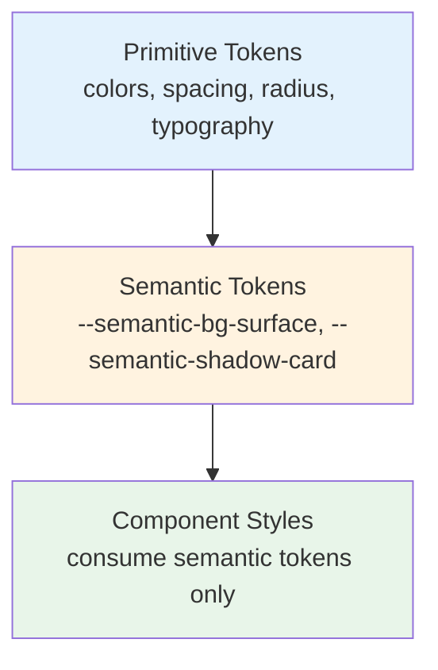
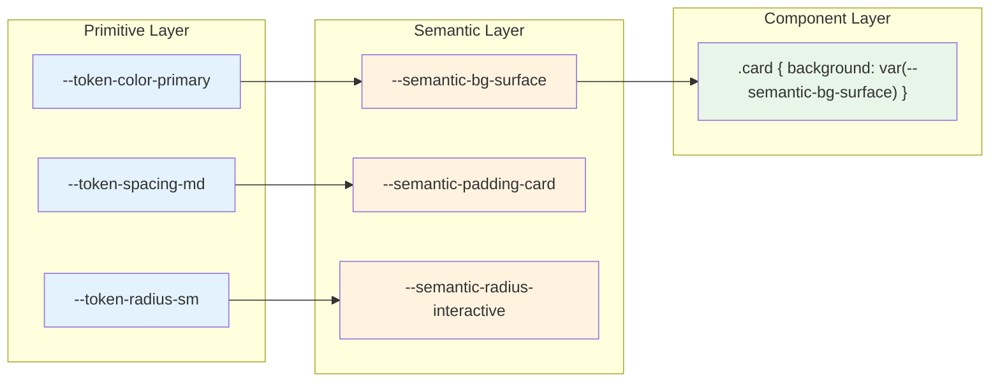
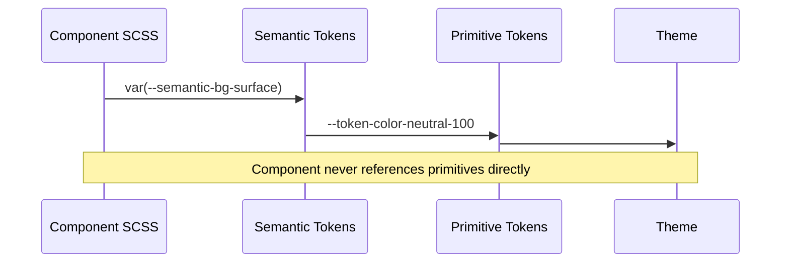

# Style Refactor Plan

> **Type**: Architecture Decision Record (ADR)
> **Status**: Active
> **Scope**: Styling Architecture — Frontend + Admin
> **Audience**: Senior Engineers, AI Agents, UI Architects

---

## 1. Purpose

The current styling architecture cannot scale to support a commercial SaaS platform. Component-specific variables leak into the global namespace, parallel styling systems duplicate effort, and the theme engine implements a fraction of its documented capabilities. This document records the architectural direction for the styling system and serves as the single source of truth for all future style-related decisions.

**Long-term goals:**

- Enable rapid theme creation without component-level changes
- Eliminate duplication between Frontend and Admin styling systems
- Establish a token hierarchy that grows linearly, not exponentially
- Centralize Angular Material integration into a single override strategy
- Make `styles.scss` a clean import entry point, not a catch-all

---

## 2. Current Architectural Problems

For detailed implementation findings, refer to [UI_AUDIT.md](UI_AUDIT.md).

| Problem | Architectural Impact |
|---------|---------------------|
| Component-scoped variables exposed globally | Exponential variable growth; themes become fragile |
| Parallel Admin / Frontend styling systems | Duplicate tokens, divergent evolution, doubled maintenance |
| `styles.scss` as a global dumping ground | No modular boundary; changes risk unintended side effects |
| Theme Engine implements only color switching | Multi-dimensional theming is architecturally impossible |
| Missing semantic token layer | Themes couple directly to primitives; no abstraction |
| Angular Material overrides scattered across components | Inconsistent visual language; impossible to audit |
| No scalable SaaS architecture | Adding features increases style complexity non-linearly |

---

## 3. Target Architecture

### 3.1 Style Hierarchy



### 3.2 Token Hierarchy



### 3.3 Theme Architecture

```mermaid
graph TB
    subgraph "Theme Definitions"
        T1["Default Theme"]
        T2["Dark Theme"]
        T3["Glass Theme"]
        TN["Custom Theme N"]
    end

    subgraph "Shared Semantic Tokens"
        ST["Semantic Token Mappings"]
    end

    subgraph "Primitive Tokens"]
        PT["Primitive Token Values"]
    end

    T1 -->|maps| ST
    T2 -->|maps| ST
    T3 -->|maps| ST
    TN -->|maps| ST
    ST -->|consumes| PT

    style T1 fill:#f3e5f5
    style T2 fill:#f3e5f5
    style T3 fill:#f3e5f5
    style TN fill:#f3e5f5
    style ST fill:#fff3e0
    style PT fill:#e3f2fd
```

### 3.4 Frontend + Admin Shared Architecture

```mermaid
graph TB
    subgraph "Shared Design System"
        PT["Primitive Tokens"]
        ST["Semantic Tokens"]
        MT["Material Overrides"]
    end

    subgraph "Frontend"
        FE["Frontend Components<br/>consume semantic tokens"]
    end

    subgraph "Admin"]
        AD["Admin Components<br/>consume semantic tokens"]
        AL["Admin Layout Tokens<br/>sidebar-width, toolbar-height"]
    end

    PT --> ST
    ST --> FE
    ST --> AD
    MT --> FE
    MT --> AD
    AL --> AD

    style PT fill:#e3f2fd
    style ST fill:#fff3e0
    style MT fill:#fce4ec
    style FE fill:#e8f5e9
    style AD fill:#e8f5e9
    style AL fill:#fff9c4
```

### 3.5 Angular Material Integration

```mermaid
graph TB
    subgraph "Angular Material"]
        M1["mat-card"]
        M2["mat-button"]
        M3["mat-table"]
        MN["mat-component-N"]
    end

    subgraph "Centralized Overrides"]
        CO["_material-overrides.scss<br/>single source of truth"]
    end

    subgraph "Semantic Tokens"]
        ST["--semantic-* tokens"]
    end

    ST --> CO
    CO --> M1
    CO --> M2
    CO --> M3
    CO --> MN

    style M1 fill:#e0e0e0
    style M2 fill:#e0e0e0
    style M3 fill:#e0e0e0
    style MN fill:#e0e0e0
    style CO fill:#fce4ec
    style ST fill:#fff3e0
```

### 3.6 Component Styling Flow



### 3.7 Overall Styling Architecture

```mermaid
graph TB
    subgraph "Entry Point"]
        Entry["styles.scss<br/>imports only"]
    end

    subgraph "Core"]
        Base["_base.scss"]
        Reset["_reset.scss"]
    end

    subgraph "Tokens"]
        Primitive["_primitive-tokens.scss"]
        Semantic["_semantic-tokens.scss"]
    end

    subgraph "Themes"]
        Themes["theme/*.scss<br/>semantic mappings per theme"]
    end

    subgraph "Overrides"]
        Material["_material-overrides.scss"]
    end

    subgraph "Components"]
        CompStyles["Component .scss files<br/>semantic tokens only"]
    end

    Entry --> Base
    Entry --> Primitive
    Entry --> Semantic
    Entry --> Themes
    Entry --> Material

    Primitive --> Semantic
    Semantic --> Themes
    Themes --> Material
    Semantic --> CompStyles

    style Entry fill:#e8f5e9
    style Base fill:#e3f2fd
    style Primitive fill:#e3f2fd
    style Semantic fill:#fff3e0
    style Themes fill:#f3e5f5
    style Material fill:#fce4ec
    style CompStyles fill:#e8f5e9
```

---

## 4. Architecture Decisions (ADR)

### ADR-001: Three-Layer Token Hierarchy

**Problem:** Component-specific variables create exponential growth. Adding a new component introduces new global variables, making themes fragile and tightly coupled to implementation details.

**Decision:** Enforce a strict three-layer hierarchy: Primitive Tokens → Semantic Tokens → Component Styles.

**Rationale:** Primitives define raw design values. Semantics provide contextual meaning. Components consume only semantics, creating a clean abstraction boundary.

**Consequences:**
- Adding a new theme requires modifying only semantic mappings
- Components cannot leak implementation details into the global namespace
- Theme count and component count grow independently

**Expected Benefits:** Linear scaling of design tokens regardless of component count.

---

### ADR-002: Single Shared Token System

**Problem:** Maintaining separate Frontend and Admin token systems duplicates effort, creates visual inconsistencies, and doubles the maintenance burden for every design change.

**Decision:** One shared token system serves both Frontend and Admin. Admin declares only layout-specific values (sidebar width, toolbar height).

**Rationale:** Both surfaces share the same brand identity, typography scale, spacing system, and elevation model. Separation was a premature optimization.

**Consequences:**
- Admin inherits Frontend token architecture
- Layout-specific admin values remain isolated in a dedicated admin-layout tokens file
- A single token change propagates to both surfaces

**Expected Benefits:** Single source of truth for all design values. Reduced regression risk.

---

### ADR-003: styles.scss Becomes Imports Only

**Problem:** A monolithic entry file containing overrides, utility classes, and global rules creates hidden dependencies and makes architectural auditing impossible.

**Decision:** `styles.scss` contains only import statements. All styling logic moves into dedicated modules under organized folders.

**Rationale:** Import-only entry points make the architecture visible at a glance and enforce modular boundaries.

**Consequences:**
- Every CSS rule lives in a named module with a clear responsibility
- Adding new global styles requires creating a new module, not appending to the entry file
- Build tools can tree-shake unused modules more effectively

**Expected Benefits:** Immediate architectural visibility. Reduced risk of unintended side effects.

---

### ADR-004: Multi-Dimensional Theme Engine

**Problem:** Themes that swap only colors fail to provide distinct visual identities. A dark theme and a glass theme should differ in typography, spacing, radius, elevation, density, motion, and layout behavior.

**Decision:** Every theme defines mappings across nine dimensions: Colors, Typography, Spacing, Radius, Elevation, Density, Motion, Layout, and Effects.

**Rationale:** Commercial SaaS platforms require themes that express complete visual identities, not color presets.

**Consequences:**
- Theme definitions are larger but more expressive
- Switching themes triggers coordinated changes across all visual dimensions
- The theme service becomes the runtime orchestrator for multi-dimensional swaps

**Expected Benefits:** Themes that feel architecturally distinct rather than cosmetically different.

---

### ADR-005: Centralized Angular Material Overrides

**Problem:** Scattered Material overrides produce inconsistent component styling and make it impossible to audit or reason about the visual language.

**Decision:** All Angular Material overrides live in a single `_material-overrides.scss` file, consumed by semantic tokens.

**Rationale:** Centralization creates a single audit point and ensures Material components respect the semantic token system.

**Consequences:**
- No component may override Material styles inline
- Material theming flows through the same token hierarchy as custom components
- The override file becomes a documented contract, not an ad-hoc collection

**Expected Benefits:** Consistent Material integration. Full auditability.

---

### ADR-006: Semantic Token Consumption Contract

**Problem:** Components that consume primitive tokens or hardcoded values bypass the abstraction layer, creating tight coupling between components and themes.

**Decision:** Every component style must consume semantic tokens exclusively. Direct primitive references and hardcoded design values are forbidden.

**Rationale:** The contract ensures themes can swap without touching component code, which is the foundation of scalable theming.

**Consequences:**
- Component SCSS files reference only `--semantic-*` variables
- Build-time or lint-time enforcement may be added to verify compliance
- Violations are treated as architectural regressions

**Expected Benefits:** Theme-component decoupling. Safe theme swaps at runtime.

---

### ADR-007: Responsive Token Strategy

**Problem:** Hardcoded breakpoints and responsive values scattered across components make layout adjustments fragile and non-composable.

**Decision:** Responsive behavior is expressed through semantic tokens that map to breakpoint-aware values, consumed via CSS container queries or media queries.

**Rationale:** Responsive tokens centralize breakpoint logic and allow components to inherit responsive behavior without declaring media queries.

**Consequences:**
- Breakpoint changes propagate globally through token updates
- Components remain responsive by default without per-component media queries
- The token system becomes the single source of truth for responsive behavior

**Expected Benefits:** Consistent responsive behavior. Reduced per-component complexity.

---

### ADR-008: Theme Service Responsibilities

**Problem:** Without a centralized runtime service, theme switching relies on ad-hoc DOM manipulation and scattered CSS class toggling.

**Decision:** A dedicated `ThemeService` owns theme state, applies multi-dimensional mappings, persists user preferences, and broadcasts theme changes to subscribed components.

**Rationale:** A single service eliminates race conditions, ensures all dimensions swap atomically, and provides a clean API for consumers.

**Consequences:**
- Theme switching becomes a service call, not DOM manipulation
- Components subscribe to theme changes rather than polling or guessing
- The service becomes the integration point for analytics, persistence, and SSR hydration

**Expected Benefits:** Atomic theme swaps. Predictable state management.

---

### ADR-009: Admin and Frontend Share One Design System

**Problem:** Separate design systems for Admin and Frontend create visual drift, duplicate token definitions, and inconsistent user experience across surfaces.

**Decision:** Admin and Frontend share the same token hierarchy, theme engine, and Material overrides. Admin declares only layout-specific exceptions.

**Rationale:** A unified design system ensures brand consistency and reduces maintenance overhead. Admin surfaces benefit from the same theming capabilities as Frontend.

**Consequences:**
- Admin inherits all semantic tokens and themes by default
- Layout-specific admin values (sidebar, toolbar) remain isolated
- A design change in the shared system benefits both surfaces simultaneously

**Expected Benefits:** Visual consistency. Halved maintenance effort. Shared theming capabilities.

---

### ADR-010: Commercial SaaS Scalability Principles

**Problem:** The current architecture scales non-linearly. Adding components, themes, or surfaces increases complexity exponentially.

**Decision:** The styling architecture must satisfy three scalability principles:
1. **Linear Growth**: Adding a component adds zero global variables.
2. **Independent Scaling**: Theme count, component count, and surface count grow independently.
3. **Zero Hardcoded Values**: Every design value flows through the token system.

**Rationale:** Commercial SaaS platforms require architectures that predict cost and risk at any scale. Non-linear growth makes future changes exponentially more expensive.

**Consequences:**
- The token system becomes the rate-limiting factor for growth, not a bottleneck
- New features integrate without architectural debt
- The system remains auditable regardless of component count

**Expected Benefits:** Predictable scaling. Reduced technical debt accumulation.

---

### ADR-011: Token Reconciliation Strategy

**Problem:** The current architecture maintains two independent token systems: Frontend tokens and Admin tokens. These systems contain duplicate definitions for spacing, radius, typography, shadows, and colors. When a design value changes (e.g., the primary color or spacing scale), the change must be applied in two places, creating drift and visual inconsistency. There is no defined strategy for resolving conflicts when the same token exists in both systems with different values.

**Decision:** Establish a single reconciliation strategy governed by the following rules:

1. **Source of Truth**: The Frontend token system (`src/styles/tokens/`) becomes the canonical source of truth for all shared design tokens. This choice is arbitrary but necessary; the frontend system is more mature and contains more comprehensive theme definitions.

2. **Conflict Resolution**: When the same token exists in both Frontend and Admin systems:
   - If values are identical: remove the Admin duplicate.
   - If values differ by intent (e.g., admin uses a slightly darker surface): promote the difference to a semantic token with a descriptive name (e.g., `--semantic-bg-admin-surface`) rather than duplicating the primitive.
   - If values differ accidentally: adopt the Frontend value and update Admin consumers.

3. **Allowed Divergence**: Admin may only declare tokens that are structurally unique to the admin surface:
   - `--admin-sidebar-width`
   - `--admin-toolbar-height`
   - `--admin-content-margin`
   - Layout-specific grid values

4. **Migration Principles**:
   - Phase 1: Inventory all Admin tokens and classify each as SHARED, ADMIN-ONLY, or CONFLICT.
   - Phase 2: Remove all SHARED duplicates from Admin; point Admin imports to the shared token system.
   - Phase 3: Resolve CONFLICT tokens using the rules above.
   - Phase 4: Isolate ADMIN-ONLY tokens in a dedicated `_admin-layout-tokens.scss` file.
   - Phase 5: Delete the old Admin token files.

5. **Expected Final Architecture**:
   ```
   src/styles/tokens/           ← Shared primitives + semantics (source of truth)
   src/admin/styles/
     _admin-layout-tokens.scss  ← Admin-only structural values
     admin.scss                 ← Admin entry (imports shared tokens + layout tokens)
   ```

**Rationale:** A single source of truth eliminates the fundamental cause of visual drift. By choosing one side as canonical rather than attempting a merge, the migration becomes directional and auditable. Admin-only tokens are explicitly scoped, preventing future accidental duplication.

**Consequences:**
- All Admin token imports must be rewritten to reference the shared system
- The Admin token files become deprecated and are eventually deleted
- A design change in the shared system propagates to both surfaces automatically
- Admin layout tokens remain isolated and do not pollute the shared namespace

**Expected Benefits:** Eliminated token duplication. Single-point design changes. Guaranteed visual consistency across Frontend and Admin surfaces.

---

### ADR-012: Theme Model Synchronization

**Problem:** The TypeScript theme model (`src/app/core/themes/theme-config.ts` and related files), the SCSS token structure (`src/styles/tokens/`, `src/styles/themes/`), and the architecture documentation currently describe different systems. The TypeScript model defines one set of theme properties, the SCSS files define another, and the documentation describes a third. This mismatch causes runtime errors, missing variables, and confusion during theme development.

**Decision:** Establish a synchronization contract requiring all three representations to describe exactly the same architecture:

1. **Single Canonical Model**: The TypeScript `Theme` interface becomes the canonical definition of theme dimensions. Every property in this interface must have a corresponding SCSS custom property and documentation entry.

2. **Synchronization Contract**:
   - When a new theme dimension is added to the TypeScript model, the corresponding SCSS token must be added to all theme partials simultaneously.
   - When a SCSS token is removed, the TypeScript property and documentation entry are removed together.
   - Documentation always reflects the current TypeScript interface, not a conceptual ideal.

3. **Three-Way Mirror Rule**: Every theme change updates all three artifacts together:
   ```
   TypeScript Interface  ←→  SCSS Theme Partials  ←→  Documentation
         │                         │                        │
         └────────── must be in sync ───────────────────────┘
   ```

4. **Enforcement**: Future changes to the theme system must include updates to all three representations in a single commit. Partial updates (e.g., changing only SCSS without updating TypeScript) are treated as architectural regressions.

5. **Verification Checklist** (applied before every theme-related merge):
   - [ ] TypeScript `Theme` interface matches SCSS token names exactly
   - [ ] Every theme partial defines all properties from the interface
   - [ ] Documentation lists all dimensions present in the interface
   - [ ] No orphaned properties exist in any one representation

**Rationale:** Without a synchronization contract, the three representations will continue to drift apart, making theme development error-prone and documentation unreliable. Treating the TypeScript interface as canonical provides a machine-checkable source of truth.

**Consequences:**
- Theme changes become slightly more involved (three artifacts instead of one) but significantly more reliable
- The documentation becomes verifiable rather than aspirational
- Runtime theme switching and build-time SCSS theming remain aligned

**Expected Benefits:** Eliminated model mismatch. Reliable theme development. Documentation that accurately reflects implementation.

---

## 5. Migration Safety

The migration from the current styling architecture to the target architecture follows strict safety principles to ensure the application remains functional at every stage.

### 5.1 Buildable State Guarantee

Every migration phase leaves the application in a fully buildable state. No phase introduces breaking changes that prevent `npm run build` from succeeding. If a phase requires temporary coexistence of old and new systems (e.g., both token systems active during reconciliation), the migration is split into smaller steps until each step is non-breaking.

### 5.2 Rollback Strategy

Each migration phase is independently reversible:

- **Phase-level rollback**: Revert the git commit range for the specific phase. Each phase targets a distinct set of files, minimizing collateral impact.
- **Token rollback**: Old token files are preserved in git history and can be restored if the new system introduces regressions.
- **Theme rollback**: The default theme remains unchanged during migration, providing a safe fallback if a new theme introduces visual errors.

### 5.3 Verification After Each Phase

After completing each migration phase, the following verification steps are mandatory:

1. `npm run build` succeeds with zero errors
2. All existing themes render correctly in both Frontend and Admin surfaces
3. No console warnings related to missing CSS custom properties
4. The application builds for production (`npm run build --configuration=production`)

### 5.4 Incremental Migration Principles

- **No big-bang migrations**: Each phase addresses one architectural concern independently.
- **Coexistence period**: During token reconciliation, old and new systems coexist temporarily. Old files are deleted only after all consumers migrate.
- **Dead-code detection**: Before deleting legacy files, a full-text search confirms zero remaining references.
- **Feature-flag readiness**: High-risk phases (component migration, styles.scss cleanup) may be guarded by feature flags for gradual rollout.

---

## 6. Migration Strategy

### Phase 1: Architecture Audit

| Item | Detail |
|------|--------|
| **Goal** | Establish baseline understanding of current style architecture |
| **Scope** | Inventory all token files, theme definitions, Material overrides, and global CSS |
| **Expected Result** | Complete map of current state; no code changes |

### Phase 2: Semantic Token System

| Item | Detail |
|------|--------|
| **Goal** | Introduce the semantic token layer between primitives and components |
| **Scope** | Define semantic token naming convention; create initial semantic mappings |
| **Expected Result** | Three-layer hierarchy is architecturally present and documented |

### Phase 3: Theme Engine V2

| Item | Detail |
|------|--------|
| **Goal** | Implement multi-dimensional theme switching |
| **Scope** | Extend theme definitions to cover all nine dimensions; build ThemeService |
| **Expected Result** | Themes swap colors, typography, spacing, radius, elevation, density, motion, layout, and effects |

### Phase 4: Material Integration

| Item | Detail |
|------|--------|
| **Goal** | Centralize all Angular Material overrides |
| **Scope** | Create `_material-overrides.scss`; migrate scattered overrides |
| **Expected Result** | Single audit point for Material styling; semantic token compliance |

### Phase 5: Admin / Frontend Unification

| Item | Detail |
|------|--------|
| **Goal** | Merge parallel token systems into one shared system |
| **Scope** | Remove duplicate admin tokens; isolate admin layout-specific values |
| **Expected Result** | Single token system serves both surfaces |

### Phase 6: styles.scss Cleanup

| Item | Detail |
|------|--------|
| **Goal** | Transform `styles.scss` into an imports-only entry point |
| **Scope** | Move all CSS logic into dedicated modules; leave only imports in entry file |
| **Expected Result** | Architectural visibility at a glance; modular boundaries enforced |

### Phase 7: Component Migration

| Item | Detail |
|------|--------|
| **Goal** | Migrate all components to consume semantic tokens exclusively |
| **Scope** | Replace primitive references and hardcoded values with semantic tokens |
| **Expected Result** | Full compliance with ADR-006; theme-component decoupling achieved |

### Phase 8: Premium UI

| Item | Detail |
|------|--------|
| **Goal** | Apply polished visual design using the new architecture |
| **Scope** | Implement premium component styling, micro-interactions, and visual refinements |
| **Expected Result** | Commercial-grade UI built on the correct architectural foundation |

### Phase 9: Animations

| Item | Detail |
|------|--------|
| **Goal** | Introduce theme-aware animation system |
| **Scope** | Define motion tokens; implement transition patterns per theme |
| **Expected Result** | Animations respect theme dimensions; consistent motion language |

### Phase 10: Final Verification

| Item | Detail |
|------|--------|
| **Goal** | Verify architectural compliance across the entire codebase |
| **Scope** | Audit all SCSS files against ADR rules; enforce contracts via linting |
| **Expected Result** | Zero architectural violations; system ready for long-term maintenance |

---

## 7. Target End-State

After migration is complete, the styling architecture satisfies the following conditions:

### Where Things Live

| Concern | Location |
|---------|----------|
| **Primitive Tokens** | `src/styles/tokens/_primitive-tokens.scss` |
| **Semantic Tokens** | `src/styles/tokens/_semantic-tokens.scss` |
| **Theme Definitions** | `src/styles/themes/<theme-name>.scss` |
| **Material Overrides** | `src/styles/overrides/_material-overrides.scss` |
| **Component Styles** | Adjacent to each component (`.component.scss`) |
| **Admin Layout Tokens** | `src/admin/styles/_admin-layout-tokens.scss` (layout-only) |
| **Entry Point** | `src/styles.scss` (imports only) |

### What `styles.scss` Contains

```
Imports only:
  - core/ (base, reset)
  - tokens/ (primitives, semantics)
  - themes/ (active theme mappings)
  - overrides/ (material)
```

### Admin Integration

Admin imports the shared token system. Admin layout tokens declare only structural values (sidebar width, toolbar height). All other styling flows through shared semantic tokens.

### Workflow: Create a New Theme

1. Define primitive token values in `src/styles/themes/<theme-name>.scss`
2. Map primitives to semantic tokens across all nine dimensions
3. Register the theme in `ThemeService`
4. Theme is available for runtime switching

### Workflow: Style a New Component

1. Create adjacent `.component.scss`
2. Consume only `--semantic-*` tokens
3. Never declare global variables
4. Never reference primitives directly

### Workflow: Add a Design Token

1. If the value is a raw design primitive, add to `_primitive-tokens.scss`
2. Create a semantic alias in `_semantic-tokens.scss`
3. Components consume the semantic alias

### Architectural Source of Truth

| Document | Responsibility |
|----------|---------------|
| **STYLE_REFACTOR_PLAN.md** | Architecture decisions, target end-state, contracts |
| **STYLE_ARCHITECTURE.md** | Style hierarchy, token flow, SCSS structure |
| **THEME_ENGINE.md** | Theme engine specification and API |

---

## 8. Permanent Anti-Patterns

The following patterns are permanently forbidden. Violations are treated as architectural regressions.

| Anti-Pattern | Reason Forbidden |
|-------------|-----------------|
| **Hardcoded colors** | Bypasses token system; breaks theme switching |
| **Component-specific global variables** | Causes exponential variable growth; couples themes to components |
| **Duplicate token systems** | Creates visual drift; doubles maintenance effort |
| **New `--admin-*` token namespace** | Reintroduces parallel systems; violates ADR-009 |
| **Component overrides inside `styles.scss`** | Destroys modular boundaries; hides dependencies |
| **Random Material overrides** | Produces inconsistent styling; breaks auditability |
| **`!important`** | Breaks cascade predictability; masks architectural problems |
| **`::ng-deep`** | Escapes view encapsulation; creates global side effects |
| **Inline design values** | Bypasses token system; prevents theme-aware styling |

---

## 9. Developer & AI Contract

Every developer and AI agent must follow these rules when modifying styles:

1. **Consume semantic tokens only.** Components reference `--semantic-*` exclusively.
2. **Never declare global variables in component styles.** Component SCSS is self-contained.
3. **Never redefine theme variables outside theme files.** Theme definitions live in `src/styles/themes/`.
4. **Never hardcode design values.** Colors, spacing, radius, shadows, and typography flow through tokens.
5. **Never use `!important` or `::ng-deep`.** These bypass architectural boundaries.
6. **Material overrides live in one file.** Scattered overrides are forbidden.
7. **New themes follow the nine-dimension model.** Color-only themes are insufficient.
8. **`styles.scss` contains imports only.** Appending CSS to the entry file is forbidden.
9. **Admin reuses shared tokens.** Admin-specific namespaces are reserved for layout values only.
10. **When in doubt, read this document first.** It is the single source of truth for style architecture.

---

## 10. Documentation Relationships

Each document has one clear responsibility. Overlapping responsibilities create confusion and stale information.

| Document | Responsibility | When to Read |
|----------|---------------|-------------|
| **[STYLE_REFACTOR_PLAN.md](STYLE_REFACTOR_PLAN.md)** | Architecture decisions, target end-state, contracts | Before any architectural style changes |
| **[STYLE_ARCHITECTURE.md](STYLE_ARCHITECTURE.md)** | Style hierarchy, token flow, SCSS folder structure | Before any CSS/SCSS changes |
| **[THEME_ENGINE.md](THEME_ENGINE.md)** | Multi-dimensional theme engine specification | When adding or modifying themes |
| **[COMPONENT_GUIDELINES.md](COMPONENT_GUIDELINES.md)** | Component styling patterns and best practices | When creating new components |
| **[UI_AUDIT.md](UI_AUDIT.md)** | Current-state audit findings and cleanup tracker | For implementation-specific details |
| **[REDESIGN_PLAN.md](REDESIGN_PLAN.md)** | Phased UI redesign roadmap with atomic tasks | When planning UI work |
| **[PROJECT_STATUS.md](PROJECT_STATUS.md)** | Project status, active tasks, roadmap | For current project state |

### Overlap Recommendations

No document overlap was introduced. Each document maintains a unique responsibility:

- `STYLE_REFACTOR_PLAN.md` records **architectural decisions** (why and what)
- `STYLE_ARCHITECTURE.md` describes **how styles work** (structure and flow)
- `UI_AUDIT.md` records **current-state findings** (implementation details)
- `REDESIGN_PLAN.md` tracks **UI work tasks** (execution plan)

If future edits cause overlap, the document listed first in the table above becomes the single source of truth for that topic.

---

*This document is maintained as a living architectural record. Updates require the same rigor as the original decisions.*